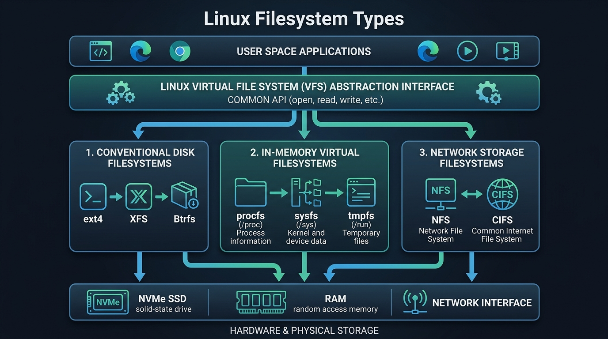

# Common Linux Filesystem Types

## 1. What is a Filesystem?

A **filesystem** is the underlying logical structure that an operating system uses to organize, name, store, retrieve, and manage data on physical or virtual storage devices.

Without a filesystem, a storage drive is merely a raw, unstructured sequence of bits and bytes. The filesystem acts like a library's cataloging system: it tracks file names, directory structures, permissions, timestamps, data block allocations, and metadata.



```text
+-------------------------------------------------------------------------+
|                    LINUX FILESYSTEM CLASSIFICATIONS                     |
+-------------------------------------------------------------------------+
|                                                                         |
|  1. Conventional Block / Disk Filesystems                               |
|     ├── ext4      (Default on Debian/Ubuntu; rock-solid journaling)     |
|     ├── XFS       (Default on RHEL/CentOS/Rocky; high-scale throughput) |
|     └── Btrfs     (Default on Fedora/openSUSE; copy-on-write snapshots) |
|                                                                         |
|  2. Flash Memory Filesystems (Raw Embedded NAND/NOR)                    |
|     └── UBIFS, YAFFS2, JFFS2                                            |
|                                                                         |
|  3. Virtual & In-Memory Pseudo-Filesystems                              |
|     ├── procfs (/proc)    ── Kernel runtime state & process metadata    |
|     ├── sysfs  (/sys)     ── Hardware subsystem & driver configuration  |
|     ├── tmpfs  (/run, /tmp) ── Blazing fast RAM-backed volatile storage |
|     └── devtmpfs (/dev)   ── Device nodes managed dynamically by udev   |
|                                                                         |
|  4. Network & Distributed Filesystems                                   |
|     ├── NFS       (Network File System - standard Unix remote sharing)  |
|     ├── CIFS/SMB  (Samba - cross-platform Windows network shares)       |
|     └── Ceph/GlusterFS (Clustered & distributed storage pools)          |
|                                                                         |
+-------------------------------------------------------------------------+
```

---

## 2. Conventional Disk Filesystems

These are the standard filesystems formatted onto hard disk drives (HDDs), Solid-State Drives (SSDs), and NVMe drives:

### 1. `ext4` (Fourth Extended Filesystem)
- **Status**: The most widely adopted and proven filesystem across the Linux ecosystem (standard default for Debian, Ubuntu, and Linux Mint).
- **Architecture**: Journaling block filesystem.
- **Key Advantages**:
  - Excellent stability, mature tooling (`e2fsprogs`), and backward compatibility with `ext2` and `ext3`.
  - Uses extents to reduce disk fragmentation.
  - Supports file sizes up to 16 TiB and filesystem volumes up to 1 EiB.

### 2. `XFS`
- **Status**: Default filesystem on enterprise distributions like Red Hat Enterprise Linux (RHEL), CentOS Stream, Rocky Linux, and AlmaLinux.
- **Architecture**: 64-bit high-performance journaling filesystem.
- **Key Advantages**:
  - Exceptional parallel I/O throughput and scalability for massive files and heavy database workloads.
  - Supports online filesystem growth (`xfs_growfs`) and metadata journaling for rapid crash recovery.

### 3. `Btrfs` (B-Tree Filesystem)
- **Status**: Default on Fedora Workstation and openSUSE.
- **Architecture**: Copy-on-Write (CoW) advanced filesystem.
- **Key Advantages**:
  - Built-in snapshotting (instant rollback of system state before updates).
  - Integrated volume management, dynamic subvolumes, and software RAID.
  - Checksumming for all data and metadata, enabling self-healing data corruption detection.

---

## 3. Flash Storage Filesystems

Standard filesystems assume a hardware storage controller handles wear leveling (as SSDs and USB flash drives do). However, embedded microcontrollers and IoT devices often use **raw NAND/NOR flash memory** chips directly:
- **`UBIFS` (Unsorted Block Image FS)**: Designed for raw flash memory; works on top of UBI volumes to handle bad blocks and wear-leveling in software.
- **`JFFS2` / `YAFFS2`**: Earlier-generation log-structured flash filesystems for embedded microchips.

---

## 4. Virtual & In-Memory Pseudo-Filesystems

Virtual filesystems do not store data on permanent disks. They reside in RAM or are generated on-the-fly by the kernel:

| Virtual Filesystem | Mount Point | Description |
| :--- | :--- | :--- |
| **`procfs`** | `/proc` | Exposes real-time kernel data structures, hardware specs (`cpuinfo`, `meminfo`), and running process statistics (`/proc/<PID>/`). |
| **`sysfs`** | `/sys` | A structured hierarchy exposing kernel device drivers, buses, power states, and tunable kernel parameters. |
| **`tmpfs`** | `/tmp`, `/run` | RAM-backed storage; files are read/written at memory speed and are automatically wiped on reboot. |
| **`devtmpfs`** | `/dev` | Populates device node files (like `/dev/sda`, `/dev/null`, `/dev/tty`) as hardware is discovered. |

---

## 5. Comparison Matrix of Common Linux Filesystems

| Filesystem | Design Type | Journaling / CoW | Max File Size | Best Use Case |
| :--- | :--- | :--- | :--- | :--- |
| **ext4** | Extent-based | Journaling | 16 TiB | General-purpose desktops, Ubuntu/Debian servers, web servers. |
| **XFS** | Allocation Groups | Journaling | 8 EiB | Enterprise servers (RHEL), big data analytics, large databases. |
| **Btrfs** | Copy-on-Write | CoW + Snapshots | 16 EiB | Modern desktops (Fedora), systems needing instant rollback snapshots. |
| **ZFS** | Copy-on-Write | CoW + Pooled | 16 EiB | Enterprise storage arrays, NAS appliances (TrueNAS), high-resilience servers. |
| **tmpfs** | In-Memory | Volatile (RAM) | Dynamic (RAM size) | Fast temporary cache, `/run` runtime sockets, `/tmp`. |
| **VFAT / exFAT** | FAT Table | Non-Journaling | 4 GiB (FAT32) / 16 EiB (exFAT) | Cross-platform USB flash drives and SD cards shared with Windows/macOS. |