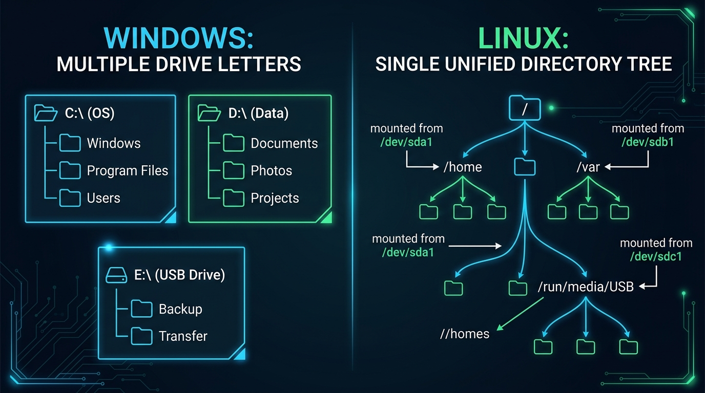

# Partitions, Filesystems & Mounting: The Storage Model

## 1. Physical vs. Logical Storage

When working in Linux, it is essential to distinguish between the **physical storage medium (the hardware)** and the **logical organization (the software)**:



```text
+-------------------------------------------------------------------------+
|                        THE STORAGE SYSTEM ANALOGY                       |
+-------------------------------------------------------------------------+
|                                                                         |
|  1. Physical Drive (HDD / NVMe / SSD)                                   |
|     └─ Like an entire physical office building.                         |
|                                                                         |
|  2. Partition (/dev/sda1, /dev/nvme0n1p1)                               |
|     └─ A dedicated floor or partitioned suite within that building.     |
|                                                                         |
|  3. Filesystem (ext4, XFS, Btrfs)                                       |
|     └─ The filing cabinets, labeled folders, and catalog indexing       |
|        system installed inside the suite to store readable files.       |
|                                                                         |
|  4. Mount Point (/home, /var, /mnt/data)                                |
|     └─ The doorway and address sign that connects that suite directly   |
|        into the unified hallway (the root directory /).                 |
|                                                                         |
+-------------------------------------------------------------------------+
```

- **Partition**: A contiguous, isolated boundary carved out on a physical disk. Partitions are represented in Linux as device nodes inside `/dev/`.
- **Filesystem**: The internal data structure (inodes, block groups, superblock, journals) created by "formatting" a partition (e.g., using `mkfs.ext4 /dev/sda1`).
- **Mounting**: The operation of attaching a formatted partition's filesystem to a specific directory in the system hierarchy.

---

## 2. Partition Naming Conventions in Linux

Linux identifies physical storage drives and their individual partitions through standard names in the `/dev` directory:

| Device Node | Interface / Drive Type | Description |
| :--- | :--- | :--- |
| **`/dev/sda`** | SATA / SAS / SCSI / USB | The first physical SATA/SCSI drive discovered by the kernel. |
| **`/dev/sda1`**, **`/dev/sda2`** | SATA / SCSI Partitions | Partition 1 and Partition 2 on the first drive (`sda`). |
| **`/dev/sdb1`** | Secondary SATA / SCSI | Partition 1 on the second drive (`sdb`). |
| **`/dev/nvme0n1`** | NVMe SSD | First NVMe controller (`nvme0`), namespace 1 (`n1`). |
| **`/dev/nvme0n1p1`**, **`...p2`** | NVMe Partitions | Partition 1 (`p1`) and Partition 2 (`p2`) on NVMe drive 0. |
| **`/dev/vda1`** | VirtIO Virtual Disk | First virtual drive partition on KVM/QEMU cloud virtual machines. |
| **`/dev/mmcblk0p1`** | SD Card / eMMC | Partition 1 on an SD card (e.g., Raspberry Pi boot drive). |

---

## 3. The Mounting Model: Single Unified Tree

In Linux, there are **no drive letters** (like `C:`, `D:`, or `E:`). Instead, every partition, internal drive, USB thumb drive, network share, and CD-ROM is attached (mounted) to a specific directory within a **single unified tree rooted at `/`**.

```text
LINUX UNIFIED TREE (All Disks in One Tree)
                 / (Root - Disk 1: /dev/nvme0n1p2)
                 ├── bin/
                 ├── etc/
                 ├── home/ ───────────► (Mounted from Disk 2: /dev/sda1)
                 │   └── student/
                 │       └── documents/
                 ├── var/
                 │   └── log/ ────────► (Mounted from Disk 3: /dev/sdb1)
                 └── run/
                     └── media/
                         └── student/
                             └── USB-DRIVE/ ──► (Mounted from USB: /dev/sdc1)
```

### How Mounting Works:
```bash
# Temporarily attach a secondary storage partition to /mnt/data
$ sudo mount /dev/sdb1 /mnt/data

# Safely detach storage before unplugging
$ sudo umount /mnt/data
```

Persistent mounts that survive system reboots are configured in the **`/etc/fstab`** (Filesystem Table) configuration file.

---

## 4. Windows vs. Linux Storage Architecture

```text
WINDOWS STORAGE MODEL                       LINUX STORAGE MODEL
(Separate Drive Trees)                      (Single Unified Inverted Tree)

  C:\ (OS Drive)      D:\ (Data Disk)                     / (Root Directory)
  ├── Windows\        ├── Projects\                       ├── bin/
  ├── Program Files\  └── Games\                          ├── etc/
  └── Users\                                              ├── home/ (Disk 2)
                                                          ├── var/  (Disk 3)
  E:\ (USB Thumb Drive)                                   └── mnt/
  └── Backup.zip                                              └── usb/ (USB Drive)
```

| Feature | Windows | Linux |
| :--- | :--- | :--- |
| **Drive Architecture** | Multiple independent root drive letters (`C:\`, `D:\`, `E:\`). | A single, unified inverted tree originating at root (**`/`**). |
| **Partition Identifier** | Disk 0 Partition 1 | Device nodes in `/dev/` (e.g., `/dev/sda1`, `/dev/nvme0n1p1`). |
| **Default Filesystems** | NTFS, FAT32, exFAT | **`ext4`**, **`XFS`**, **`Btrfs`** (supports NTFS/exFAT via drivers). |
| **Path Separators** | Backslash (`\`) (e.g., `C:\Users\student\doc.txt`) | Forward slash (**`/`**) (e.g., `/home/student/doc.txt`). |
| **Storage Expansion** | Add a new drive letter (`E:`, `F:`). | Mount transparently to any directory (e.g., mount new NVMe drive directly to `/var/lib/docker`). |
| **Removable Media** | Automatically assigned next available letter (`D:`, `E:`). | Automatically mounted to `/run/media/<user>/<label>`. |