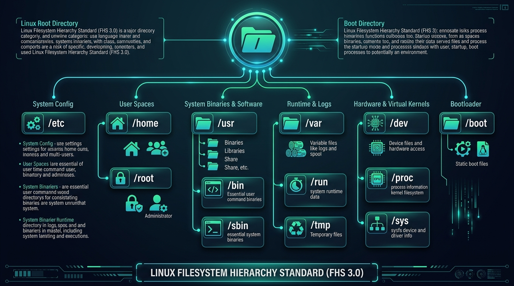

# The Filesystem Hierarchy Standard (FHS)

## 1. What is the FHS?

The **Filesystem Hierarchy Standard (FHS)** is an open specification that standardizes the names, locations, and intended purposes of directories on Linux and other Unix-like operating systems.

- **Current Specification**: **FHS 3.0** (originally released by The Linux Foundation, now maintained under **FreeDesktop.org**).
- **Core Benefit**: **Interoperability and Portability**. Because distributions adhere to this standard, a sysadmin or developer can navigate Ubuntu, Debian, Red Hat Enterprise Linux, Fedora, openSUSE, or Arch Linux without having to re-learn where configurations, system binaries, log files, or user data reside.



```text
+-------------------------------------------------------------------------+
|                 FILESYSTEM HIERARCHY STANDARD (FHS 3.0)                 |
+-------------------------------------------------------------------------+
|                                                                         |
|  / (The Single Root Directory)                                          |
|  ├── bin ──────► Symlink to /usr/bin (Essential user command binaries)  |
|  ├── sbin ─────► Symlink to /usr/sbin (System administration binaries)  |
|  ├── lib ──────► Symlink to /usr/lib (Core shared libraries)            |
|  ├── usr/        (General user software layer & system resources)       |
|  │   ├── bin/    (Standard applications: python, gcc, git, bash)        |
|  │   ├── sbin/   (Admin utilities: fdisk, iptables, ip)                 |
|  │   ├── lib/    (Architecture shared libraries)                        |
|  │   ├── local/  (Custom admin-compiled software & scripts)             |
|  │   └── share/  (Architecture-independent data: man pages, icons)      |
|  ├── etc/        (Host-specific system-wide configuration text files)   |
|  ├── home/       (Personal user home directories: /home/username)       |
|  ├── root/       (Superuser / administrative root home directory)       |
|  ├── var/        (Variable runtime data: logs, databases, mail spools)  |
|  │   ├── log/    (System and application log files)                     |
|  │   └── spool/  (Queued tasks: printing, mail, cron jobs)              |
|  ├── tmp/        (Temporary volatile cache; often cleared on reboot)    |
|  ├── run/        (Runtime process state, PID files, and active sockets) |
|  ├── dev/        (Device nodes: /dev/sda, /dev/null, /dev/urandom)      |
|  ├── proc/       (Virtual filesystem: kernel state & process info)      |
|  ├── sys/        (Virtual filesystem: hardware drivers & bus control)   |
|  ├── boot/       (Static boot files: Linux kernel vmlinuz, initramfs)   |
|  ├── opt/        (Add-on third-party vendor software packages)          |
|  ├── srv/        (Site-specific data served by this system: web/FTP)    |
|  ├── mnt/        (Temporary manual mount point for sysadmins)           |
|  └── media/      (Mount points for removable storage / optical media)   |
|                                                                         |
+-------------------------------------------------------------------------+
```

---

## 2. Comprehensive FHS Directory Reference

| Directory | Purpose in Linux | Windows Equivalent | macOS Equivalent |
| :--- | :--- | :--- | :--- |
| **`/`** | **Root directory**. The parent of all files and folders. | `C:\` | `/` |
| **`/home`** | Regular user accounts and documents (e.g., `/home/student`). | `C:\Users\` | `/Users/` |
| **`/root`** | Administrative superuser (`root`) home directory. | *No direct equivalent* | `/var/root` |
| **`/etc`** | System-wide text configuration files (e.g., `/etc/passwd`, `/etc/fstab`, `/etc/ssh/`). | Registry & `C:\Windows\System32\` | `/etc` $\to$ `/private/etc` |
| **`/bin`** & **`/usr/bin`** | Primary user command binaries (`ls`, `cp`, `grep`, `bash`, `python`). | `C:\Windows\System32\` | `/usr/bin` |
| **`/sbin`** & **`/usr/sbin`** | System administrator binaries (`reboot`, `iptables`, `fdisk`, `useradd`). | `C:\Windows\System32\` | `/usr/sbin` |
| **`/lib`** & **`/usr/lib`** | Shared libraries (`.so` files) required by binaries in `/bin` and `/sbin`. | `.dll` files in `System32` | `/usr/lib` |
| **`/var`** | Variable data that changes during operation (logs in `/var/log/`, databases in `/var/lib/`). | `C:\ProgramData\` & `C:\Windows\Logs\` | `/var` $\to$ `/private/var` |
| **`/tmp`** | Temporary scratch space accessible to all users; cleared periodically. | `C:\Windows\Temp\` | `/tmp` $\to$ `/private/tmp` |
| **`/dev`** | Device node interfaces representing physical and virtual hardware (`/dev/sda`, `/dev/null`). | Device Manager / Kernel objects | `/dev` |
| **`/proc`** | Virtual pseudo-filesystem exposing real-time kernel & process state. | *Task Manager internals* | *No direct equivalent* |
| **`/sys`** | Virtual pseudo-filesystem exposing hardware drivers, power states, and device trees. | *Device Manager internals* | *No direct equivalent* |
| **`/boot`** | Bootloader configurations (GRUB), compressed Linux kernel (`vmlinuz`), and `initramfs`. | Windows Boot Manager | Firmware / Preboot |
| **`/run`** | In-memory (`tmpfs`) runtime state (PID files, daemon control sockets) since last boot. | *RAM runtime state* | `/var/run` |
| **`/opt`** | Self-contained third-party application bundles (e.g., Google Chrome, Zoom). | `C:\Program Files\` | `/Applications/` |
| **`/srv`** | Site-specific data served by network daemons (e.g., web server data, FTP roots). | `C:\inetpub\` | `/Library/WebServer/` |
| **`/mnt`** | Dedicated temporary manual mount point used by system administrators. | *Manual drive mappings* | `/Volumes/` |
| **`/media`** | Mount point for removable media (USB sticks, optical discs, SD cards). | Drive Letters (`E:\`, `F:\`) | `/Volumes/` |

---

## 3. Removable Media Handling

Continuing the *"everything is in the unified tree"* rule, removable storage devices (USB thumb drives, external SSDs, SD cards) do not get separate drive letters.

- **Modern Linux (GNOME / KDE / systemd-uDisks)**:
  When a user named `student` inserts a USB flash drive with the filesystem label `FEDORA`, the desktop automounts it to:
  ```text
  /run/media/student/FEDORA/
  ```
  A file on the drive called `README.txt` is accessed directly at `/run/media/student/FEDORA/README.txt`.
- **Server / Older Distributions**:
  May use `/media/FEDORA` or require manual mounting to `/mnt`.

---

## 4. The FHS as a "Trailing Standard"

> [!NOTE]
> The FHS is recognized as a **trailing standard**—meaning it codifies established, proven best practices rather than rigidly dictating new ones in advance. 
> 
> While distributions might implement modern architectural enhancements (like the **UsrMerge** where `/bin` symlinks to `/usr/bin`), the core top-level directories remain consistent across 99% of all Linux distributions.