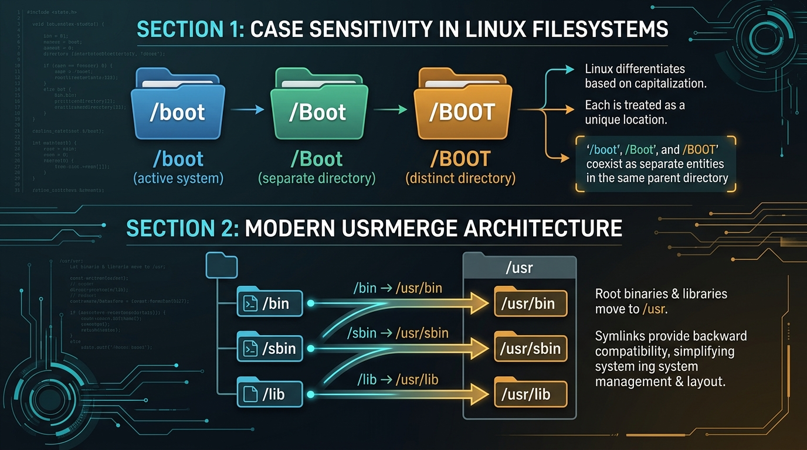

# Deep Dive: Case Sensitivity, The `/usr` Hierarchy & Path Navigation

## 1. Case Sensitivity in Linux

One of the most noticeable differences when transitioning from Windows or macOS to Linux is that **Linux filesystems are strictly case-sensitive**.



```text
In Linux:
  /boot      ───► Directory 1 (Valid system boot folder)
  /Boot      ───► Directory 2 (Completely separate folder)
  /BOOT      ───► Directory 3 (Another completely separate folder)
```

### Windows & macOS vs. Linux
- **Windows (NTFS) & macOS (APFS by default)**: **Case-Insensitive, Case-Preserving**. They remember that you typed `MyNotes.txt`, but typing `mynotes.txt` or `MYNOTES.TXT` will access the exact same file.
- **Linux (ext4, XFS, Btrfs)**: **Case-Sensitive**. Every character's case must match precisely.

```bash
# Trying to change directory to /Home will fail:
$ cd /Home
bash: cd: /Home: No such file or directory

# Exact case must be supplied:
$ cd /home
$ pwd
/home
```

> [!TIP]
> **Best Practice Convention**: In the Linux ecosystem, always use **lowercase letters, hyphens (`-`), or underscores (`_`)** when naming files and directories (e.g., `project-notes.md` instead of `Project Notes.md`). This eliminates casing mistakes, space-escaping issues, and path lookup bugs in scripts.

---

## 2. The `/usr` Directory & The Modern UsrMerge

Historically, Unix systems divided software into two tiers due to the storage limitations of early hard drives:
1. **Root (`/`)**: Stored only the minimal tools needed to boot and repair the machine in single-user mode (`/bin`, `/sbin`, `/lib`).
2. **`/usr` (Unix System Resources)**: Stored the larger general-purpose application and software layer (`/usr/bin`, `/usr/lib`), which was often mounted from a second, larger physical drive after boot.

```text
+-------------------------------------------------------------------------+
|                       SUBDIRECTORIES UNDER /usr                         |
+-------------------------------------------------------------------------+
|                                                                         |
|  /usr                                                                   |
|  ├── bin/        (Standard user-facing commands: python3, git, gcc)     |
|  ├── sbin/       (System administration daemons & commands)             |
|  ├── lib/        (Shared library files .so required by /usr/bin)        |
|  ├── share/      (Architecture-independent data: man pages, docs)       |
|  ├── include/    (C/C++ header files .h used for compiling code)        |
|  └── local/      (Software manually installed by the local admin)       |
|      ├── bin/    (Self-compiled scripts & custom binaries)              |
|      └── lib/    (Libraries for local custom software)                  |
|                                                                         |
+-------------------------------------------------------------------------+
```

### The Modern "UsrMerge"
On modern Linux distributions (Fedora, Debian, Ubuntu, Arch, RHEL), storage drives are vast, making the old partition split obsolete. 

Modern distros implement the **UsrMerge**, where the historical root directories are now **symbolic links** pointing directly into `/usr`:

```text
/bin   ───────────► Symbolic link to /usr/bin
/sbin  ───────────► Symbolic link to /usr/sbin
/lib   ───────────► Symbolic link to /usr/lib
/lib64 ───────────► Symbolic link to /usr/lib64
```

> [!NOTE]
> When looking for an executable program on Linux, **`/usr/bin`** is the standard location for distro-packaged software, while **`/usr/local/bin`** is reserved for custom programs compiled or installed manually by the administrator.

---

## 3. Path Navigation: Absolute vs. Relative Paths

When referencing files or navigating directories, Linux supports two path types:

```text
ABSOLUTE PATH (Always starts with /):
  /home/student/projects/linux/notes.txt
  └─ Explicit, unambiguous, works from any current location.

RELATIVE PATH (Does NOT start with /):
  projects/linux/notes.txt   (Relative to /home/student)
  └─ Resolved relative to your Current Working Directory (pwd).
```

### Special Path Symbols

| Notation | Meaning | Example |
| :--- | :--- | :--- |
| **`.`** | The **current working directory**. | `./script.sh` (Execute script in current folder) |
| **`..`** | The **parent directory** (one level up). | `cd ..` (Move up one directory level) |
| **`~`** | The current user's **home directory**. | `cd ~/documents` (Expands to `/home/username/documents`) |
| **`-`** | The **previous working directory**. | `cd -` (Jump back to the previous directory) |
| **`/`** | The **root directory** (or path separator). | `cd /` (Move to the root of the filesystem) |